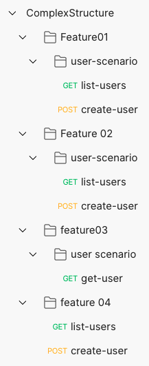
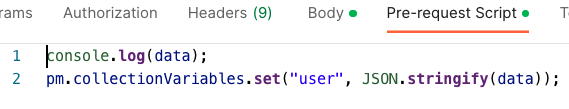
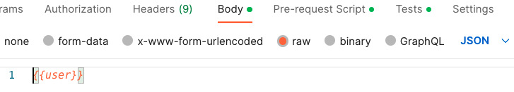
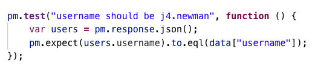

# Collection and Complex Test Data

## Collection Structure



## Run newman

```sh
newman run ComplexStructure.postman_collection.json
```

```sh
newman -h
```

```sh
newman run -h
```

## Run newman with Top Level Collection

```sh
newman run ComplexStructure.postman_collection.json --folder Feature01
```

```sh
newman run ComplexStructure.postman_collection.json --folder 'Feature 02'
```

## Run newman with Multiple Top Level Collection

```sh
newman run ComplexStructure.postman_collection.json --folder Feature01 --folder 'Feature 02'
```

## Run newman with Specific Request

```sh
newman run ComplexStructure.postman_collection.json --folder list-users
```

```sh
newman run ComplexStructure.postman_collection.json --folder get-user
```

## Run newman with data file

```sh
newman run ComplexStructure.postman_collection2.json -d newuser.json
```

## Use data file in Request Body

- newuser.json

  ```json
  [
    {
      "name": "J Newman04",
      "username": "j4.newman",
      "email": "j.newman@karina.biz",
      "address": {
        "street": "Kattie Turnpike",
        "suite": "Suite 198",
        "city": "Lebsackbury",
        "zipcode": "31428-2261",
        "geo": {
          "lat": "-38.2386",
          "lng": "57.2232"
        }
      },
      "phone": "024-648-3804",
      "website": "ambrose.net",
      "company": {
        "name": "Hoeger LLC",
        "catchPhrase": "Centralized empowering task-force",
        "bs": "target end-to-end models"
      }
    }
  ]
  ```

1. Inline data with data file

   

2. Inline data object

   

   

3. Use data file in Test

   